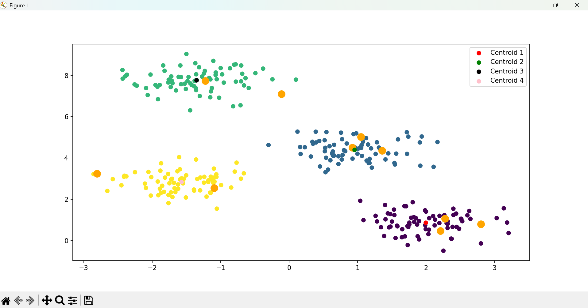
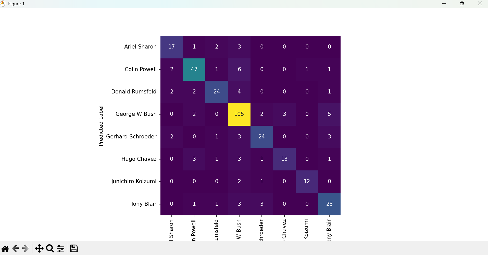
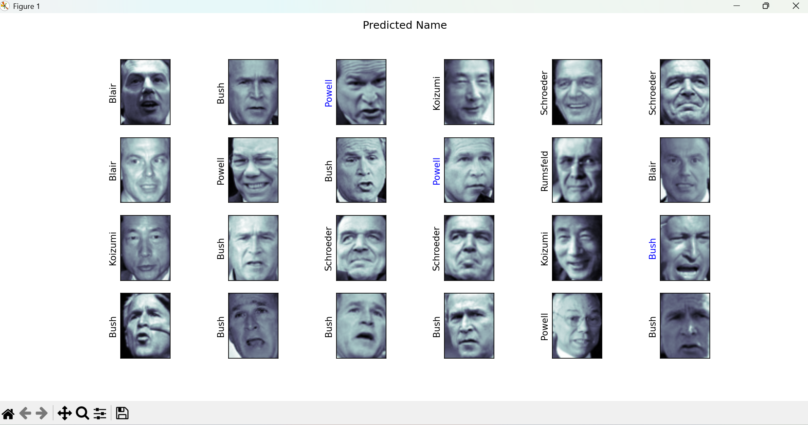
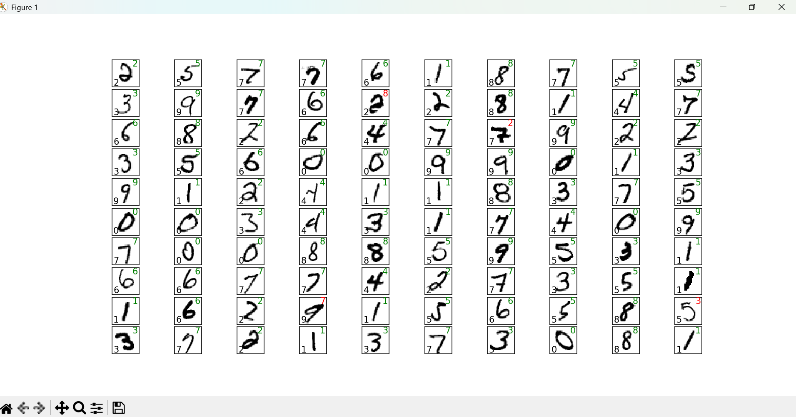

# Python Machine Learning
## Example

### Actually & Predicted Compare
</img>

### Seaborn
</img>

### K-Values Compare
</img>

### K-Means
</img>

### SVM - Face Recognition
</img>

</img>

### Neural Network - Character Recognition
</img>
